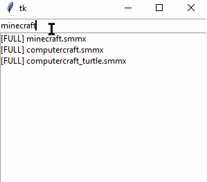

# SimpleMindPro Quick Search (Proof of Concept)

## Summary

A one-day proof of concept solution in all it's ~~glory~~ ugliness.

Written in python using [tkinter](https://docs.python.org/3/library/tkinter.html) GUI for drawing a search-box and search-results. Also, it uses [fast-autocomplete](https://pypi.org/project/fast-autocomplete/) library for better results. The app provided "as is" but you can always submit an issue and/or a pull request.



## Why

Recently, I'd modified the manifest for SimpleMindPro app for Windows allowing it to open files with long names (paths with greater than 255 characters). It allows me to structure knowledge more accurately. Lengthy paths are supported by DropBox but not by the SimpleMindPro; the search stops working in some cases (most likely when search-terms match Mind-Map files with long names). Also, the SimpleMindPro is unable to navigate to linked mind-maps with long file names too. So, I'd spend the entire day and implemented a full-text search to cover one of the issues.

## Installing Requirements:

Install [pyenv](https://github.com/pyenv-win/pyenv-win). Then in the current directory run:

````ps1
pip install -r requirements.txt
````

## Usage

First of all, you have to set a correct root mind-map path in the main script. Then you can run it.

Change `xxx` (or entire `rootdir`) in `./smmx-search.py` in the following line:

```python
rootdir = 'C:/Users/xxx/Dropbox/SimpleMind'
```

to a directory, containing your SimpleMind mind-maps, e.g.:

```python
rootdir = 'C:/Users/MyFancyUserName/Dropbox/SimpleMind'
```

then you can run the script using:

```cmd
python .\smmx-search.py
```

or

```cmd
.\start.bat
```

When the script starts, it scans the root mind-map directory and listens for <kbd>Alt+Shift+s</kbd> keyboard shortcut globally in the background. When the shortcut is triggered it opens a window where you can search whatever you like inside all your mind-maps. When you press the same shortcut or ESC, it closes the window. Notice, for now, the close button in the window itself works as an emergency closing facility - when you close the window via the close button, it closes; but when you press the global shortcut again it's causing the exception in the app because the window is destroyed and the background shortcut listener thread not handling this situation. This crash is causing the process to close.

Gotchas:

1. It's not optimized and uses quite a lot of memory.
2. It scans the root directory only once upon the start. To see updates, restart is needed.
3. The app may not work as expected.
4. Tested only on Windows 10 with python 3.9.
